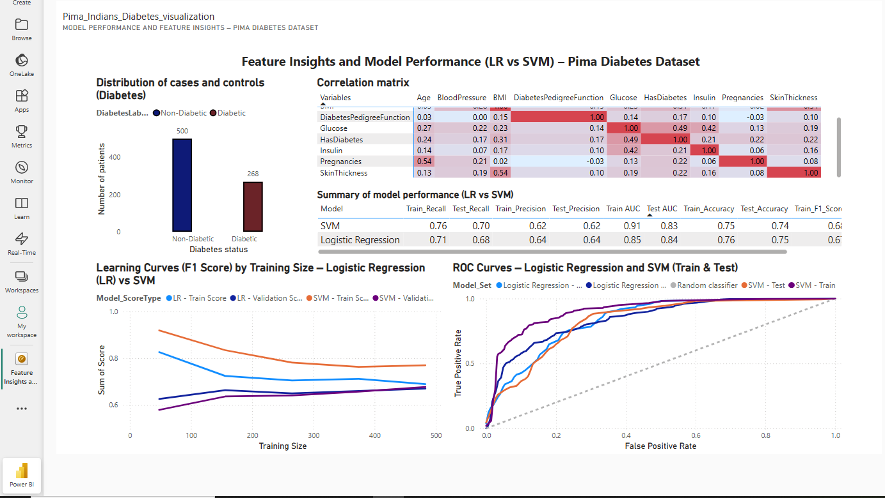

#  Pima Indians Diabetes Prediction – Azure Machine Learning


## Table of Contents
- [Summary](#summary)
- [Project Structure](#project-structure)
- [Requirements](#requirements)
- [Dataset](#dataset)
- [Pipeline Overview](#pipeline-overview)
- [Model Deployment](#model-deployment)
- [Testing the Endpoint](#testing-the-endpoint)
- [Visualization (Power BI)](#visualization-power-bi)
- [Reproducibility Notice](#reproducibility-notice)

##  Summary

This project uses the **Pima Indians Diabetes Dataset** to train and deploy a logistic regression model that predicts the onset of diabetes.  
Two models were trained and compared:  
- **Logistic Regression (LR)**  
- **Support Vector Machine (SVM)**

The logistic regression model, having better performance, was deployed using:
- Azure Container Instances (ACI) for quick testing
- Azure ML Online Endpoints (v2) for production-grade deployment

---

##  Project Structure

| File                              | Description                                                              |
|-----------------------------------|--------------------------------------------------------------------------|
| `pimadiabetes.csv`                | Raw dataset from Kaggle                                                  |
| `data_diabetesPima_clean.csv`     | Cleaned dataset ready for training                                       |
| `preprocessing.py`               | Python script for data cleaning and preparation                          |
| `submit_preprocessing.ipynb`      | Notebook to run preprocessing as a job on Azure ML                       |
| `train_and_log.py`               | Training script with MLflow logging                                      |
| `submit_train.ipynb`              | Notebook to submit training job to Azure ML                              |
| `score.py`                        | Script used for model inference (used by deployment endpoint)            |
| `requirements.txt`                | Pip dependencies for ACI deployment                                      |
| `environment.yaml`                | Conda environment for Online Endpoint (SDK v2)                           |
| `endpoint.yaml`                   | YAML file to define the Online Endpoint v2                               |
| `deployment.yaml`                 | YAML file to deploy the model to the endpoint                            |
| `deploiement_aci_pima.ipynb`      | Notebook to deploy the model using ACI                                   |
| `test.json`                       | JSON input file for testing the deployed model                           |

---

##  Requirements

- Python ≥ 3.7
- Azure CLI installed and configured (`az login`)
- Azure ML CLI extension (`az extension add -n ml`)
- Active Azure subscription with an ML workspace

---

## Dataset

Download the dataset from Kaggle:  
https://www.kaggle.com/datasets/uciml/pima-indians-diabetes-database

Rename it to:

```text
pimadiabetes.csv
```

Place it in the root directory of the project.

---

##  Pipeline Overview

### 1. Preprocessing

```bash
python preprocessing.py --input_path ./ --output_path ./
```

Or run on Azure ML:

```bash
submit_preprocessing.ipynb
```

**Output:**
- `data_diabetesPima_clean.csv`
- `correlation_matrix.csv`

---

### 2. Model Training

```bash
python train_and_log.py
```

Or run on Azure ML:

```bash
submit_train.ipynb
```

**Output:**
- `metrics_summary.csv`
- `roc_combined.csv`
- `learning_curves_combined.csv`
---
---

## Model Deployment

### A. Deployment to ACI

Run on Azure ML::

```bash
deploiement_aci_pima.ipynb
```

### B. Production Deployment via Online Endpoint (SDK v2)

```bash
az login
az account set --subscription <YOUR_SUBSCRIPTION_ID>
az ml workspace set --name <YOUR_WORKSPACE_NAME> --resource-group <YOUR_RESOURCE_GROUP>

# Create the endpoint
az ml online-endpoint create --file endpoint.yaml --workspace-name <YOUR_WORKSPACE_NAME> --resource-group <YOUR_RESOURCE_GROUP>

# Deploy the model to the endpoint
az ml online-deployment create --file deployment.yaml   --workspace-name <YOUR_WORKSPACE_NAME>   --resource-group <YOUR_RESOURCE_GROUP>   --endpoint-name pima-diabetes-endpoint   --all-traffic
```
---
##  Testing the Endpoint

```bash
az ml online-endpoint invoke   --name pima-diabetes-endpoint   --request-file test.json   --resource-group <YOUR_RESOURCE_GROUP>   --workspace-name <YOUR_WORKSPACE_NAME>
```
**Example `test.json` file:**

```json
{
  "data": [
    [6, 148, 72, 35, 0, 33.6, 0.627, 50]
  ]
}
```
---
## Visualization (Power BI)

Use the following CSV files:
- `data_diabetesPima_clean.csv`
- `correlation_matrix.csv`
- `metrics_summary.csv`
- `roc_combined.csv`
- `learning_curves_combined.csv`
### Power BI Dashboard Preview

---

##  Reproducibility Notice

To keep this repository lightweight:

Only the original dataset `pimadiabetes.csv` is included.  
Intermediate files like:

- `data_diabetesPima_clean.csv`
- `correlation_matrix.csv`
- `metrics_summary.csv`
- `roc_combined.csv`
- `learning_curves_combined.csv`

... are generated by executing the scripts provided.

---

## Author

**Edoh Kodji**   
edoh.kodji@gmail.com
